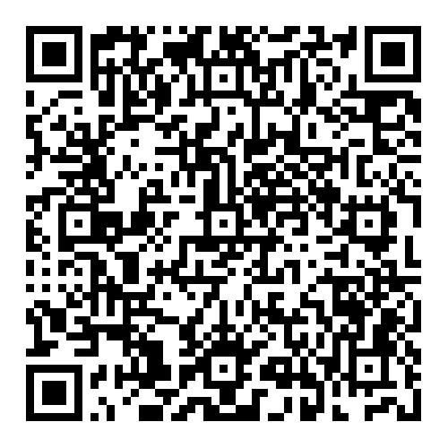

# TODO List CLI

## Fonctionnalités

* **Gestion des tâches** : créer, lister, mettre à jour et supprimer des tâches
* **Suivi du statut** : workflow à trois états (TODO -> DOING -> DONE)
* **Système de priorité** : trois niveaux de priorité (LOW, MEDIUM, HIGH)
* **Dates d’échéance** : suivi optionnel des dates d’échéance avec filtrage par date
* **Filtrage** : filtrer les tâches par statut, priorité ou date d’échéance
* **Tri** : trier les tâches selon différents critères, par ordre croissant ou décroissant

## Utilisez ou contribuez ici !

[https://github.com/maxregenassPro/heig-vd-dai-course-java-ios-practical-work1](https://github.com/maxregenassPro/heig-vd-dai-course-java-ios-practical-work1)
(ou en scannant le code QR :p)

## Auteurs

**Maxime Regenass** et **Santiago Sugranes**

